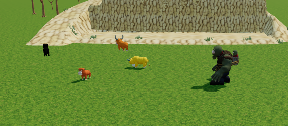
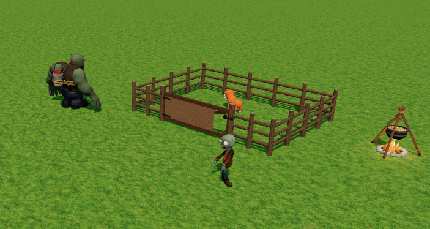
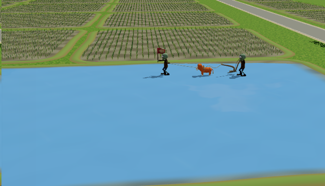

#  Summer Roam · 夏野兜兜

[简体中文](README.md) | [English](README.en.md)

使用 Three.js 制作的桌面端 3D 自由驾驶与田野探索游戏。开着橙色小车游览乡间道路、水渠、树林和住宅，观察动物活动，体验营地抓牛、逃跑救援和水田耕作。

项目标识为 `summer-roam`。

## 游戏截图

**田野动物**



**营地围栏**



**水田耕作**



## 本地运行

需要 Node.js ≥22.13.0。依赖版本由 `package-lock.json` 固定。

```sh
npm ci
npm start
```

打开 `http://localhost:5173/`。端口冲突时可运行 `npm start -- --port 5174`。

## 操作

| 操作 | 按键 |
| --- | --- |
| 前进 / 后退 | W / S 或上下方向键 |
| 转向 | A / D 或左右方向键 |
| 漂移 / 刹车 | Shift + 转向 / 空格 |
| 选择对象并展开动作圈 | 左键或 E |
| 执行动作 | 动作圈中的数字键 |
| 旋转 / 缩放镜头 | 右键拖动 / 滚轮 |
| 恢复车尾视角 / 重置汽车 | C / R |
| 暂停 / 车灯 / 远近光 | Esc / L / H |

耕田任务从田边扶犁工的动作圈发起。住宅音乐和动物声音随距离、静音及暂停状态变化。

## 开发与构建

```sh
npm run test:unit   # 快速回归
npm test           # 完整测试，包含实际模型和玩法集成
npm run verify     # 格式、Lint、完整测试、构建及发布校验
npm run build
npm run preview
```

部署时上传 `dist/` 内全部文件并保留相对路径。

- [开发说明](docs/development.md)：目录用途、资源制作入口和验证方式。
- [部署说明](docs/deployment.md)：构建、资源版本和发布预算。
- [资源来源与许可](assets-source/ASSETS.md)：模型、纹理和音频的来源记录。

## 许可

本项目自有源代码与制作脚本采用 [MIT License](LICENSE)。第三方代码、模型、纹理、音频和参考素材适用各自的许可；项目的 MIT License 不替代这些资源的授权。

资源清单包含非商业许可、Sketchfab Standard 许可以及授权尚未确认的素材。公开分发完整游戏或素材前，需要逐项确认相应授权。模型和音频的原有署名文件保留在 `src/assets/` 中。
